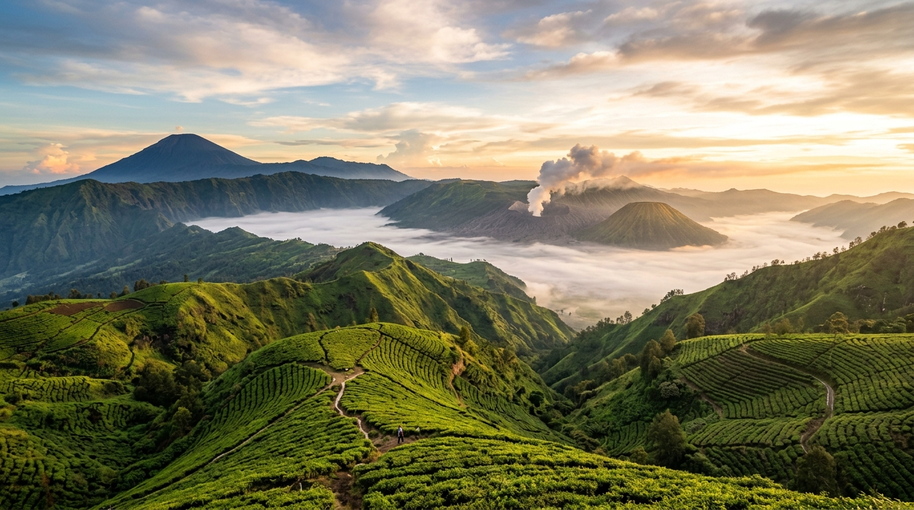
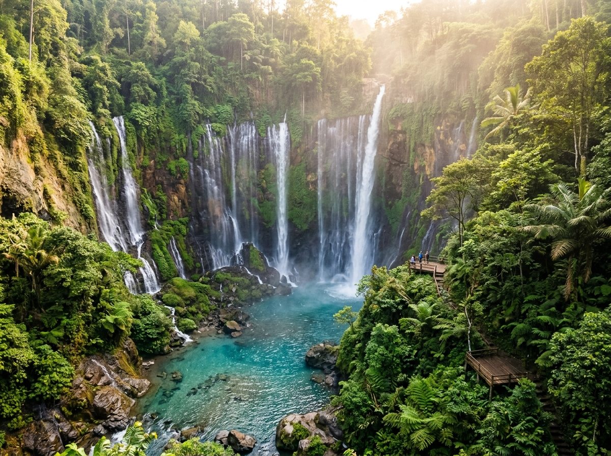
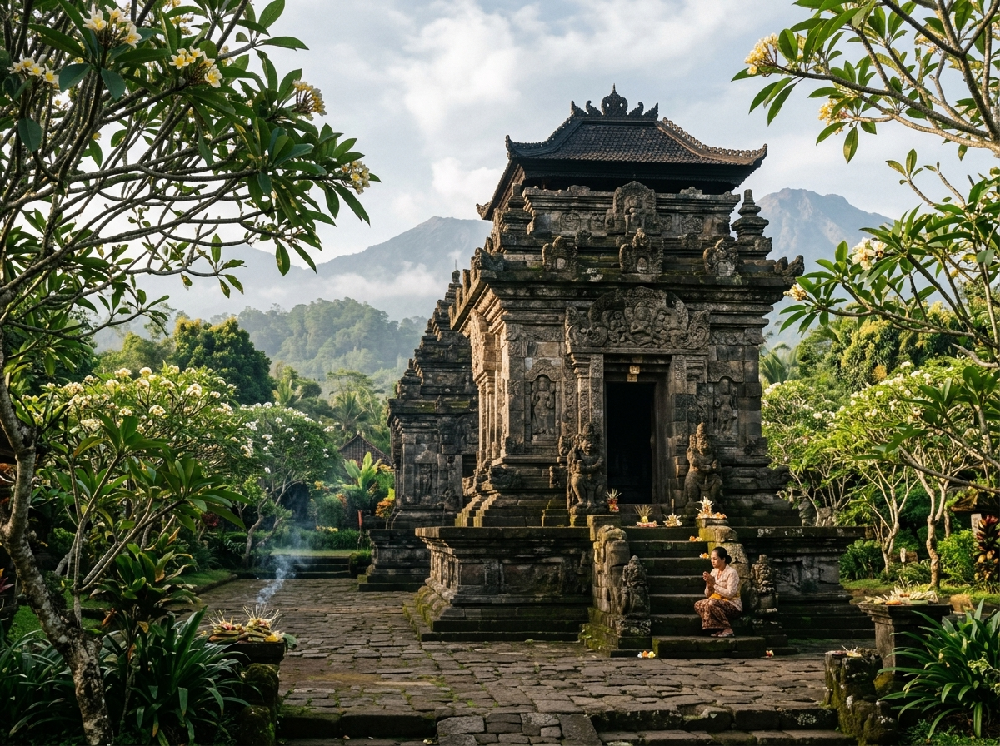
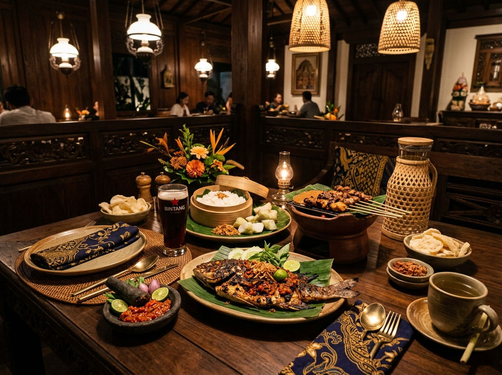
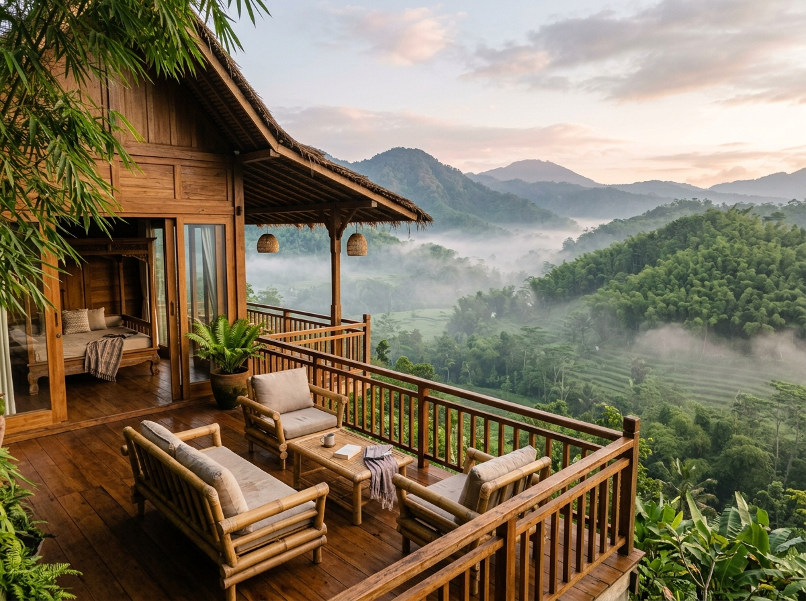

# 🏔️ Dolano - Portal Pariwisata & Manajemen Destinasi

<p align="center">
  
</p>

<p align="center">
  <b>Sistem Informasi, Portal Wisatawan & Panel Administrasi Terpadu Dolano</b><br />
  <i>Modern Full-Stack Architecture (Node.js 22 · Express · React 18 · TypeScript · Vite · Tailwind CSS)</i>
</p>

---

## 📸 Dokumentasi & Pratinjau Visual (Visual Showcase)

Semua aset gambar telah disiapkan dalam direktori `./public/assets/images/` dan `./src/assets/images/` sehingga tampil optimal baik di **GitHub Repository Markdown**, **GitHub Pages**, server lokal, maupun bundle produksi.

| Wisata Pegunungan | Wisata Air & Air Terjun | Cagar Budaya & Religi |
| :---: | :---: | :---: |
|  |  |  |
| **Kaldera Bromo & Puncak B29** | **Coban Rondo & Balekambang** | **Candi Singosari & Masjid Tiban** |

| Kuliner & Restoran Nusantara | Resor & Penginapan Alam |
| :---: | :---: |
|  |  |
| **Resto Inggil & Waroeng Dau** | **Shanaya Resort & Glamping Hills** |

---

## ✨ Fitur Utama

- **Landing Page & Portal Wisatawan**:
  - Hero visual sinematik dengan scrim kontras terukur.
  - Bento grid 3 pilar utama (Pegunungan, Air, Religi & Budaya).
  - Direktori katalog lengkap dengan filter instan dan pencarian langsung.
  - Perencana rute multi-hari (Itinerary 1-3 Hari).
  - Kalkulator estimasi biaya liburan interaktif (Backpacker, Nyaman, Mewah).
  - Panduan cuaca musiman & checklist bawaan perlengkapan.
  - Galeri momen visual resolusi tinggi dengan modal lightbox.
  - Formulir newsletter pelanggan dengan simulasi unduh panduan PDF gratis.
  - 4 tema tipografi instan: *Editorial Serif (Playfair Display)*, *Petualang Modern (Outfit)*, *Warisan Budaya (Cinzel)*, *Kontemporer (Plus Jakarta Sans)*.

- **Dashboard & Panel Admin Dolano**:
  - Ringkasan statistik destinasi, restoran, penginapan, dan subscriber buletin.
  - CRUD Wisata, Restoran, dan Penginapan lengkap dengan pratinjau modal.
  - Manajemen subscriber dan broadcast notifikasi email.

- **Kompatibilitas API Asli**:
  - `GET /apis/views.php` & `GET /admin-dolano/apis/views.php`
  - `POST /apis/create.php`
  - `POST /apis/update.php`
  - `POST /apis/delete.php`
  - REST Endpoints: `/api/stats`, `/api/wisata`, `/api/restoran`, `/api/penginapan`, `/api/subscribers`

---

## 📁 Struktur Asset Gambar (GitHub & Web Compatibility)

Untuk memastikan gambar **selalu tampil di GitHub** dan pada saat deployment:
- **Di GitHub Markdown (README)**: Menggunakan path relatif `./src/assets/images/...` atau `./public/assets/images/...` (bukan `/src/...` yang menyebabkan 404 pada parser GitHub).
- **Di React / Vite**: Menggunakan `getSafeImageUrl` dan import asset bundled langsung (`import img from '../assets/images/...'`), serta fallback web CDN otomatis jika terjadi kegagalan muat.
- **Di Server Express**: Rute statis `app.use('/assets/images', express.static(...))` dan `app.use('/src/assets/images', express.static(...))` aktif di `server.ts`.

---

## 🚀 Cara Menjalankan

```bash
# 1. Install dependensi
npm install

# 2. Jalankan development server
npm run dev
```

Server berjalan pada port `3000` (host `0.0.0.0`). Akses via browser pada:
`http://localhost:3000`


